# End to End Eye Gaze Estimation(E3GazeNet)
>   #   Network Structure
>   >   Gray input(1 Channel) -> HourglassNet + Segmentaion head -> Seg output(2 Channel:Eyelid, Iris)
>   >
>   >   -> 3 Channel(Gray - concat - Seg output) -> DenseNext20 + Regression head 
>   >
>   >   -> Result(Landmark(48 * 2) + Eye Gaze Vector(3))
>
>   # E3GazeNet Inference Output
>   ### Segmentation Eyelid Output
>   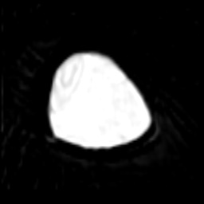
>   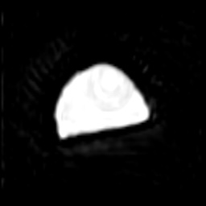
>   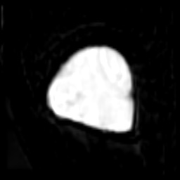
>   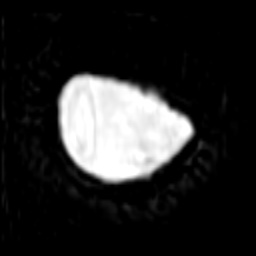
>   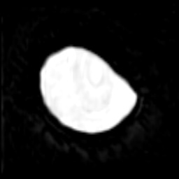
>   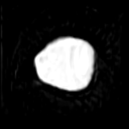
>   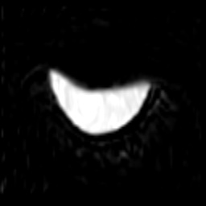
>   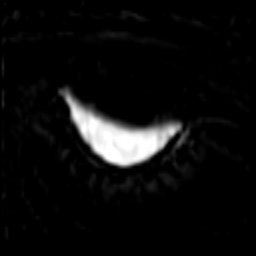
>   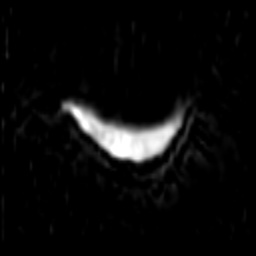
> 
>   ### Segmentation Iris Output
>   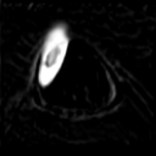
>   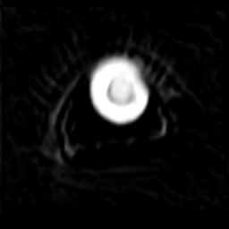
>   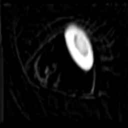
>   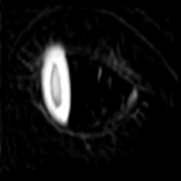
>   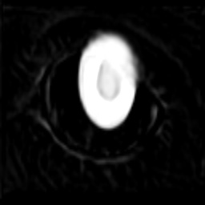
>   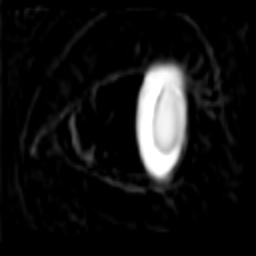
>   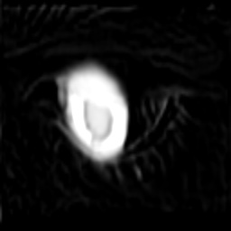
>   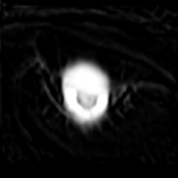
>   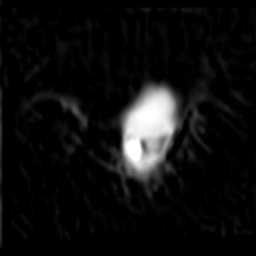
> 
>   ### Regression Output
>   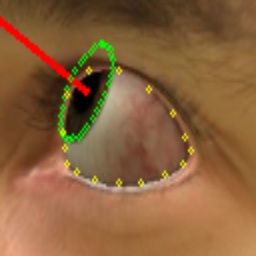
>   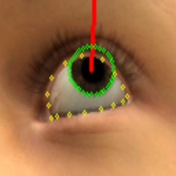
>   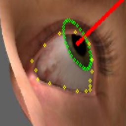
>   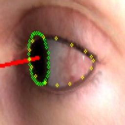
>   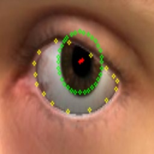
>   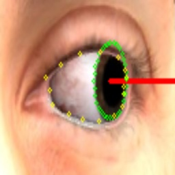
>   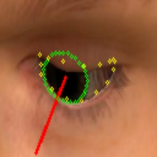
>   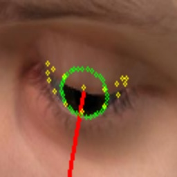
>   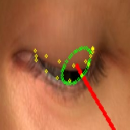

# Completed Backbone Models
> ### ResNet
>   > ##### ResNet26(Pytorch)
>   > ##### ResNet50(Pytorch)

> ### ResNext
>   > ##### ResNext14(Pytorch)
>   > ##### ResNext26(Pytorch)
>   > ##### ResNext50(Pytorch)

> ### DenseNet
>   > ##### DenseNet32(Pytorch)
>   > ##### DenseNet64(Pytorch)

> ### DenseNext
>   > ##### DenseNext32(Pytorch)
>   > ##### DenseNext64(Pytorch)

> ### SHNet(Stacked Hourglass Network)
>   >   ##### SHNet(Pytorch)

# Completed Blocks
> ### StemBlock(Pytorch)

> ### ResidualBlock(Pytorch)

> ### DenseBlock(Pytorch)

> ### HourglassBlock
>   > ##### HourglassUpBlock(Pytorch)
>   > ##### HourglassDownBlock(Pytorch)

## Reference
*   https://github.com/swook/GazeML/tree/master/datasets/UnityEyes
*   PARK, Seonwook; SPURR, Adrian; HILLIGES, Otmar. Deep pictorial gaze estimation. In: Proceedings of the European Conference on Computer Vision (ECCV). 2018. p. 721-738.